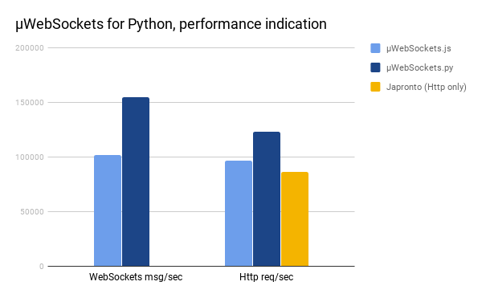

# µWebSockets.py
This is a work-in-progress Python extension much like the Node.js counterpart `µWebSockets.js`. It performs very favorably, outrunning both µWebSockets.js and Japronto by significant amount:



The idea here is to ultimately provide a seamless, pip install kind of works-out-of-the-box experience but for Python developers.

Here's what works right now:
```python
import uwebsocketspy as uWS

app = uWS.App()

def httpGet(res, req):
	res.end("Sorry, no HTTP for you this time")

app.get("/*", httpGet)

def wsOpen(ws, req):
	print("Welcome customer!");

def wsMessage(ws, message, isBinary):
	ws.send(message)

def wsClose(ws, code, message):
	print("Aw, we lost a customer");

app.ws("/*", {
	"maxPayloadLength": 1024,
	"open": wsOpen,
	"message": wsMessage,
	"close": wsClose
});

def listenHandler():
        print("Listening to port 3000")

app.listen(3000, listenHandler)

app.run()
```
