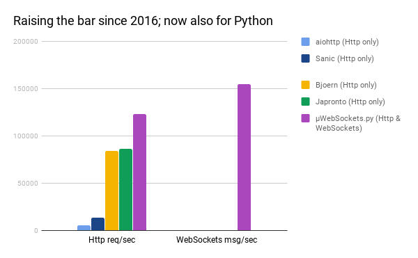

<div align="center">


*µWebSockets.py™ (it's "[micro](https://en.wikipedia.org/wiki/Micro-)") is simple, secure*<sup>[[1]](https://github.com/uNetworking/uWebSockets/tree/master/fuzzing)</sup> *& standards compliant*<sup>[[2]](https://unetworking.github.io/uWebSockets.js/report.pdf)</sup> *web I/O for the most demanding*<sup>[[3]](https://github.com/uNetworking/uWebSockets/tree/master/benchmarks)</sup> *of applications.*

• [For JavaScript](https://github.com/uNetworking/uWebSockets.js) • [User manual](https://github.com/uNetworking/uWebSockets/blob/master/misc/READMORE.md) • [Docs](https://unetworking.github.io/uWebSockets.js/generated/)

*© 2016-2019, >39,632,272 downloads*

</div>

#### In a nutshell
µWebSockets is a C++ web server and broker made available to JavaScript developers since 2016, now also available to Python developers. It integrates seamlessly to any `asyncio` project as long as `uvloop` is set up and used as event loop.

This is a **work-in-progress** Python extension much like the Node.js counterpart `µWebSockets.js`. It performs very favorably, outrunning both µWebSockets.js and Japronto by significant amount:



The idea here is to ultimately provide a seamless, pip install kind of works-out-of-the-box experience but for Python developers.

Here's what works right now:
```python
import uwebsocketspy as uWS

app = uWS.App()

def httpGet(res, req):
	res.end("Sorry, no HTTP for you this time")

app.get("/*", httpGet)

def wsOpen(ws, req):
	print("Welcome customer!");

def wsMessage(ws, message, isBinary):
	ws.send(message)

def wsClose(ws, code, message):
	print("Aw, we lost a customer");

app.ws("/*", {
	"maxPayloadLength": 1024,
	"open": wsOpen,
	"message": wsMessage,
	"close": wsClose
});

def listenHandler():
        print("Listening to port 3000")

app.listen(3000, listenHandler)

app.run()
```
